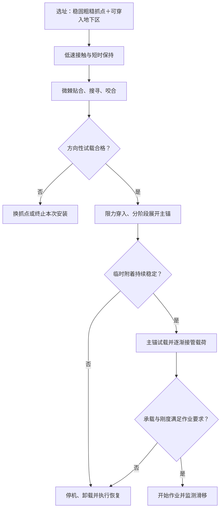

# 小天体锚定方式文献调研与组合方案论证

检索截止：2026年9月20日。研究对象：小行星等弱引力天体表面的着陆、原位探测与采样锚定。

**结论：建议将“微棘临时附着＋地下展开主锚”作为有条件的研究基线。** 其合理性在于把初始接触、安装反力支撑和长期承载分阶段解决。最适合优先研究的场景是：着陆器作用范围内同时存在可抓取的稳固粗糙岩面，以及可穿入、展开且能形成有效约束的地下介质。现有证据支持各子功能和阶段衔接原理，尚不足以证明整套方案适用于所有碎石堆小行星，或已经优于交叉钻孔锚。

## 1. 调研范围与证据使用方法

检索采用公开网络检索、论文题名与DOI追溯，并优先核对出版社、作者所在机构、NASA/JPL、ESA与arXiv的原始资料。核心词组包括 asteroid anchoring、harpoon anchor、cross-drilling geometric force closure、microspine gripper、laser-based attachment、root-inspired anchor、tip-extending anchor，以及安装反力、拔出承载和失效机制等组合。本报告是结构化专题调研，未声称完成Scopus/Web of Science全量检索或正式系统综述的穷尽筛选。

纳入原始试验、数值研究及任务官方记录；地面仿生岩土研究只作为机理旁证。商业转载、综述的转述和搜索引擎自动摘要不作为关键数值的最终依据。部分出版社内容只取得摘要和公开章节片段，相应结论不延伸至未读取的完整试验条件。文末逐条列出访问深度。

证据按实际来源区分：**任务记录、地面实物试验、短时微重力演示、数值预测、预印本**。这些类别不等同于正式技术成熟度等级。未报道或未核实的安装峰值反力、力矩、冲量、寿命和质量预算保留为未知，不按零处理。

各文献的“锚定力”可能是单个抓取器拉脱力、整套锚装置拔出力或模型阻力，不能直接作同条件性能排名；峰值也不能直接作为长期允许载荷。

## 2. 五类技术的横向比较

表中适用性是依据机理与原始资料作出的工程判断；定量事实的工况限制见第3节。

| 技术 | 优先适用地表 | 承载机理与能力判断 | 安装反力特点 | 主要失效模式及限制 |
|---|---|---|---|---|
| 鱼叉／贯入式锚 | 可贯入且有一定强度的土、冰、弱胶结层；需按介质选择速度 | 埋入锚头、倒刺与介质共同抗拔；已有数十至百牛量级地面结果 | 发射存在反冲冲量；贯入和绳索收紧还产生瞬态载荷 | 未发射、浅贯入或反弹、过穿、介质开裂、绳索松弛或断裂；单根柔性系绳不能独立约束全部转动自由度 [R1]、[R2] |
| 交叉钻孔锚 | 可钻的岩石、胶结介质或具有足够孔壁约束的地层 | 多根倾斜锚杆通过孔壁承压、摩擦与空间约束承载；已有60–250 N装置结果 | 超声钻可降低轴向钻压，但仍需持续进给支撑；不能认为多钻对称就自动消除全部反力 | 钻不进、钻屑堵塞、孔壁破坏、共同拔出破坏面、各腿入深不一致、偏载失效 [R3]–[R5] |
| 微棘 | 可暴露微观凸起、凸起本身足够坚固且整体稳固的粗糙岩面 | 多钩尖机械咬合，柔顺悬挂分担载荷；岩面试验已有百牛量级 | 需要贴合、有限压紧与切向搜寻行程；建立咬合后可承担后续工具反力 | 钩尖滑脱、弯曲或断裂、岩面凸起剥落、载荷分配不均、抓住松动岩块；厚松散粉层无法提供可靠抓点 [R6]–[R10] |
| 激光附着 | 光学可达、适合热加工的较完整岩体；需验证矿物组成与热响应 | 激光成孔后送入熔化金属，凝固形成连接；橄榄石试验最高115 N | 光束加工降低机械钻压需求，但送丝、接触保持与烧蚀喷出反冲仍需计入系统 | 界面脆裂、热裂纹、成孔或填充不足、焦点漂移；激光功率、散热与样品热改性成本较大 [R11] |
| 仿生地下展开锚 | 可穿入的颗粒层、可利用孔隙或裂隙的介质；完整硬岩通常需预成孔 | 入土后张爪、分支或外翻生长，扩大承载范围；效果取决于埋深、颗粒约束和结构强度 | 可用小截面入土与分阶段展开降低初始需求；展开、卡滞阶段仍可能出现峰值反力 | 未充分展开、颗粒流动与松脱、整体拔出、关节卡滞、柔性根破损、回收困难；地面结果不能直接外推到弱引力 [R1]、[R12]、[R13] |

**分类并不互斥。** 鱼叉描述的是进入介质的方式，地下展开描述的是入土后的构型变化；带主动张爪的鱼叉同时属于两者。本文组合方案中建议优先研究可控进给、可监测展开的主锚，是否采用发射贯入应另作决策。

## 3. 关键定量证据及其边界

| 文献／对象 | 核实到的数据 | 测量或预测对象 | 可支持的结论与不能外推之处 |
|---|---|---|---|
| Zhao等，2019，主动展开倒刺贯入锚 [R1] | 户外两种含冻土介质：60 N、178 N；同为285 mm埋深时，软黏土无／有倒刺约65／170 N，砂约11／25 N | 地面抗拔试验 | 支持“先贯入、后扩大作用范围”；承载高度依赖介质。含冻土强度不能代表小行星松散表土 |
| Wang等，2021，超声交叉钻孔 [R3] | 60–250 N | 文中锚定装置的地面试验结果 | 证明方法具备百牛量级潜力；公开材料未完整核实各数值对应的介质、尺寸和统计分布，不能用250 N设定普适额定值 |
| Wang等，2021，超声钻温度适应性 [R4] | 钻压5 N，钻削功率小于40 W；试验温度−175至100 ℃ | 该文超声钻及换能器 | 是低钻压安装路线的依据，不能认定为所有交叉锚的安装峰值，也不能与上一行直接相除构成实测性能比 |
| JPL微棘原型官方资料 [R7] | 切向大于160 N，45°方向大于150 N，法向大于180 N | 岩面抓取原型的方向性承载 | 说明微棘可提供多方向约束；三个方向是分开的结果，不能同时叠加，也不是松散星壤上的保证值 |
| Anthony等，2021，激光连接 [R11] | 橄榄石连接最高115 N；论文另列不锈钢对象超过150 N；激光功率小于5 kW | 金属—岩石等材料连接试验 | 本课题以岩石115 N为相关证据；金属结果不代表岩石性能。光功率与系统电功率必须分开 |
| Kerimoglu等，2025，根系外翻生长锚，预印本 [R12] | 300 g装置，在M90火星土模拟物中入深45 cm；3次拔出峰值108.5、109.5、139.5 N，均值119±17.6 N | 地球重力下的地面试验，外接气源 | 支持低安装需求与较高抗拔能力能够兼顾；300 g不是含外部气源的完整航天系统质量，火星土模拟物也不等于火星重力试验 |
| Zhou等，2026，仿根地下张爪锚 [R13] | 模拟力分布约2 N至超过90 N | 二维、干燥无黏聚颗粒模型的数值结果 | 体现颗粒构型导致的巨大离散性；不能将高值作为三维实物主锚能力，更不能作为可靠承载下限 |

以上论文没有提供可统一比较的完整六维承载包络、安装冲量和寿命数据。因此，“哪种锚力最大”的判断暂不能从这张表得出。

### 3.1 鱼叉：难点是可靠发射及匹配贯入能量

Philae说明初始锚定链路失效会导致反弹，但应正确区分故障位置：ESA记录明确指出鱼叉没有发射；硬地表导致冰螺钉未能穿入是另一问题，不能把两者写成“鱼叉因岩石太硬而打不进去”。[R2：ESA任务复盘](https://www.esa.int/Science_Exploration/Space_Science/Rosetta/Rosetta_and_Philae_one_year_since_landing_on_a_comet)

Zhao等的石膏试验还显示，高速贯入引起开裂后，承载可能下降。因此鱼叉速度并非越大越好；速度、锚头形状、介质完整性与允许反冲应联合设计。[R1](https://doi.org/10.1155/2019/1257038)

工程上应分别核算发射反冲与绳索张紧冲击。忽略气体和其他运动件时，可用发射体动量变化估算反冲冲量的首阶量级；实际整机应采用完整动量收支。不能把文献的锚系统总质量当成发射体质量代入。

### 3.2 交叉钻孔：是组合方案必须认真比较的基线

其优势是入孔后可形成空间约束，超声驱动又可降低钻压。后续三钻研究把载荷方向和三腿入深不一致作为变量，说明整机布局与偏载工况必须纳入比较。[R3](https://doi.org/10.1016/j.actaastro.2020.10.002)、[R5](https://www.sciencedirect.com/science/article/abs/pii/S0032591023005880)

对称布置可以降低部分合力或合力矩，却不意味着钻进方向的离面反力消失。若目标主要是可钻完整岩面，交叉钻孔可能比地下分支展开更直接；组合方案需要证明其在目标颗粒层中的安装成功率或允许承载更有优势。

### 3.3 微棘：已有“先抓住、再钻进”的原理先例

微棘依靠接触几何咬合，而非分子黏附。Asbeck等研究强调小钩尖与岩面凸起尺度匹配及柔顺载荷分担；Parness等将其用于岩面机器人与取芯装置。NASA的Microgravity Drill and Anchor System明确由锚定机构提供钻压支撑，JPL另报告了2014年抛物线飞行中的微重力钻进演示。[R6](https://doi.org/10.1177/0278364906072511)、[R8](https://doi.org/10.1002/rob.21476)、[R9](https://ntrs.nasa.gov/citations/20130014134)、[R10](https://robotics.jpl.nasa.gov/what-we-do/research-tasks/cave-robot/)

这些证据直接支持本方案的临时支撑功能。它们尚未验证“微棘支撑地下展开锚”的特定集成系统。微棘也不天然只能用于临时附着；把它分配给临时阶段是本课题的功能选择，需要通过主锚接管后的刚度、可靠性或作业收益予以证明。

### 3.4 激光附着：低机械钻压与高热功率之间的取舍

原研究中直接混合金属与岩石熔池的连接效果不佳，较有效路线为激光成孔、送入熔化金属并凝固。应称为热加工形成的物理—机械连接，避免笼统描述为“把金属直接焊在任意岩石上”。[R11](https://doi.org/10.1016/j.actaastro.2021.08.028)

本报告的工程判断是：若任务要求保持原始挥发分或避免热改性，应将附着点与科学采样点分开。对功率紧张的平台，其适用性取决于功率、加工时间、散热、指向保持及送丝系统预算，不能仅凭“无传统钻压”判定优于机械锚。

### 3.5 地下展开：区分硬质张爪与柔性生长

硬质张爪锚通过展开后增加承压范围或形成几何阻挡；柔性外翻生长锚通过尖端延伸减少已入土侧壁的持续滑移。两者需要分别评估，不能把柔性生长的低反力结论直接赋给刚性张爪。

2025年根系锚论文的自锚定现象有条件：需要先达到一定深度，而且允许装置轴向运动；被刚性约束时并未观察到相同的零净外部反力现象。因而微棘固持平台与柔性主锚之间可能需要受控轴向柔顺或力控制接口，具体是否保留该机理必须重做集成试验。[R12](https://arxiv.org/html/2511.10901v1)

2026年仿根锚研究则表明，几何卡锁与随机堵塞竞争，初始堆积状态显著影响预测承载。它支持研究地下几何约束，同时提示设计目标应放在不利工况的可靠下限。[R13](https://doi.org/10.1016/j.actaastro.2026.07.042)

## 4. 组合方案为什么合理，以及什么时候不成立

### 4.1 合理性来自安装过程的力传递闭合

建议时序为：先控制接触速度并维持短时贴合，微棘搜寻和咬合后通过小幅试载确认，再由微棘承担主锚穿入和展开的反力，最后在主锚试载合格后逐步转移作业载荷。主锚未验证前，保留临时附着。

这个流程不消除最初接触所需的支撑。微棘尚未咬合前，仍需通过接触动力学、缓冲、短时推力或其他已设计的机构维持贴合；必须证明这一阶段能完成，避免“需要先锚住才能锚住”的循环。

### 4.2 分阶段设计可放宽相互冲突的要求

微棘模块侧重快速建立连接、表面适应和可重试；主锚模块侧重作业期间的抗拔、抗剪、抗倾覆和刚度。若临时连接足够可靠，主锚可以用更慢、更低峰值反力的安装策略，而不必靠一次高能贯入尽快完成固定。这是本报告提出的设计推论，尚待同平台对照试验证实。

### 4.3 地表互补必须在同一工作空间内成立

| 地表组合 | 对本方案的判断 | 设计处理 |
|---|---|---|
| 稳固裸露岩面邻接可穿入颗粒层或裂隙区 | 优先验证场景 | 微棘抓点与主锚入口可分开布置，检查机械臂或支腿可达性 |
| 全覆盖深厚松散细颗粒层，缺少稳固抓点 | 微棘临时阶段不具备默认成立条件 | 选择其他初始保持手段或换址；不能宣称该组合覆盖全部软地面 |
| 完整致密硬岩，缺少孔隙与裂隙 | 微棘可能有效，地下展开缺乏通道 | 比较微棘直接作业、交叉钻孔或预成孔后展开的代价 |
| 表面粗糙但整块岩石松动 | 咬合成功不等于固定到小天体 | 测试岩块整体位移、转动及其与周围地层连接 |
| 脆弱壳层覆盖极松散物质 | 两级锚可能受同一次塌陷影响 | 将壳层破裂和共同拔出列为共因失效，而非当作双重冗余 |

## 5. 需要满足的力学条件

以下为方案设计判据，不是已测得性能。坐标取地表法向为n，切向为t。

安装阶段的简化筛选条件为：

\[
\gamma_{\rm inst}\,F_{\rm inst,n}^{\rm peak}\leq F_{\rm temp,n}^{\rm allow},\qquad
\gamma_{\rm inst}\,F_{\rm inst,t}^{\rm peak}\leq F_{\rm temp,t}^{\rm allow},\qquad
\gamma_{\rm inst}\,M_{\rm inst}^{\rm peak}\leq M_{\rm temp}^{\rm allow}.
\]

其中，安装载荷要覆盖穿入、展开、卡滞与反向卸载等阶段；允许值必须包含方向、表面随机性、制造偏差和已知损伤的影响。分量分别满足只是初筛，还要证明同一组接触力能够同时平衡合力和合力矩，即整个安装载荷轨迹都落在临时附着的可实现六维承载范围内。不能将互不同时发生的单向极限拼成一个虚假的承载范围。

对发射或冲击过程，还需控制残余冲量：

\[
\Delta v=J_{\rm unbalanced}/m,\qquad
\Delta\boldsymbol\omega\approx\mathbf I^{-1}\int\mathbf M_{\rm unbalanced}\,dt.
\]

后式仅是短时小姿态变化的估算，完整评估应使用转动动力学。检查应同时包含峰值力、冲量、位移和姿态偏差；只比较平均安装力不能保证不脱离。

作业阶段建议采用规定失效概率下的承载下限，而非文献最大值：

\[
F_{\rm main,LB}\geq\gamma_{\rm op}F_{\rm task},\qquad
M_{\rm main,LB}\geq\gamma_{\rm op}M_{\rm task}.
\]

这里LB表示带统计置信约束的下限；目标失效概率与安全系数应由任务要求确定。轴向试载合格并不自动证明抗扭或偏心载荷合格。主锚与微棘的可承载值也不能简单相加，载荷分配取决于相对刚度、预紧和共同地层失效。

### 5.1 弱引力条件下最容易被高估的部分

Bennu接触数据支持其近地表存在极弱、疏松的颗粒介质；因此不能默认小天体地下必然是“越深越稳”的地球土层。[R14](https://doi.org/10.1126/sciadv.abm6229)

作为首阶分析，自重形成的覆盖压力约为\(\sigma_v\sim\rho g_{\rm eff}h\)，摩擦抗剪常用\(\tau\sim c+\sigma_n\tan\varphi\)理解。弱引力会降低重力贡献的围压；很小的黏聚、颗粒形状、初始堆积、受限空间和锚主动施加的约束反而可能决定结果。这些式子只用于解释趋势，不是复杂小行星星壤的完整本构关系。

地下展开确实可能通过卡锁或约束获得承载，但在近乎无黏聚、接近自由表面且可自由重排的颗粒层中，也可能只是推开颗粒。增大展开面积并不保证可靠抗拔力增加。二维模型的“卡住”还需排除三维颗粒绕行造成的承载下降。

### 5.2 安装反力指标必须采用同一工况

可将抗拔／安装反力比\(\eta_F=F_{\rm pull,LB}/F_{\rm inst}^{\rm peak}\)作为一个指标，同时报告质量、功率、能量、安装时间和冲量。分子分母应来自同一装置、介质、重力、几何和加载条件。若外部净反力趋近零，不宜只报告比值趋于无穷，还要报告内部驱动力、压力源、功耗与初始保持需求。

## 6. 建议的结构与控制方向

以下是待验证的研究设计，不是文献已证明的最优构型。

1. **多点临时附着。** 采用分布式、可独立控制的微棘模块并配置力／位移感知。按接触几何检查六维约束，不能仅凭抓点数量认定足够。
2. **抓点与展开区可调距离。** 主锚入口尽量避开临时抓点下方潜在破坏区。距离由颗粒扰动范围和共同拔出试验确定，不预设任意固定倍数。
3. **小截面进入、限力展开。** 对硬质张爪记录驱动力—行程曲线并识别卡滞；对柔性生长方案同时验证轴向柔顺、气源预算及真空材料适应性。
4. **逐步试载与接管。** 主锚展开后分级加载，监测残余位移和刚度变化；合格后再允许采样反力提高。试载本身也可能损伤介质，阈值需由地面试验确定。
5. **保留恢复路径。** 设置停机、回退、换点和撤离状态。不可逆倒刺或不能回收的根系应与任务是否需要多次迁移相匹配。

## 7. 验证矩阵与决策门槛

首先补齐任务输入：目标天体及有效重力范围、平台质量和转动惯量、工具的力／力矩／冲量、允许位移、安装时间、可用电功率与气体预算、预计粗糙度与颗粒层厚度、是否要求可回收。缺少这些输入时，本文结论应限定为研究路线合理性，不能直接给出额定载荷与定型尺寸。

| 验证组 | 必须改变的条件 | 主要观测 | 用来排除的问题 |
|---|---|---|---|
| 微棘单模块 | 岩性、凸起强度、粗糙度、覆尘厚度、接触姿态、预压和搜寻行程 | 捕获成功率、各方向力—位移、允许力矩、损伤后承载 | 只在理想粗糙硬岩上有效 |
| 主锚单模块 | 粒径与锚尺寸比、颗粒形状、级配、密实度、黏聚、层厚与埋深 | 穿入／展开反力峰值、拔出下限、部署状态、剪切和偏载能力 | 只在特定粒径或土箱约束下卡住 |
| 两级集成 | 抓点—入口距离、展开速度、进给偏心、初始预紧、局部松动岩块 | 临时锚滑移、整机姿态、共同破坏区、切换瞬态 | 主锚部署破坏临时附着 |
| 环境与低重力 | 真空、温度循环、粉尘、重力水平 | 接触建立、颗粒迁移、保持力、机构卡滞、材料状态 | 把地面土压力或空气效应当成真实任务能力 |
| 可靠性与重复使用 | 多次随机铺床、不同抓点、安装重试、循环作业与退出 | 完整流程成功率、承载分布及置信区间、磨损和恢复成功率 | 用少数最大值替代可靠性 |

低重力验证要区分两件事：悬吊卸载可以减轻着陆器的等效重量，却不会相应减小土箱内颗粒的自重压力；倒置钻孔可以检验力传递，仍不能完整代表小天体颗粒环境。应结合经过标定的三维DEM—多体动力学模型、足够大的边界域与可获得的短时微重力试验，分别验证接触机理和整机稳定性。

建议设置三组同平台对照：微棘直接作业、交叉钻孔主锚、微棘＋地下展开主锚。统一质量／能源边界、场地与任务载荷，以完整任务成功率、承载下限、安装扰动和恢复能力比较。若组合方案只提高最佳工况的拔出峰值，却降低安装成功率或增加不可恢复故障，则不足以支持采用。

## 8. 可用于研究方案的论证表述

现有小天体锚定方式受到地表异质性与弱引力条件的共同制约：贯入锚需要匹配介质强度与发射能量，交叉钻孔锚仍需安装支撑，微棘依赖稳固表面凸起，激光连接涉及热功率和材料适配，地下展开锚则依赖有效埋深与颗粒约束。针对同时具备粗糙稳固抓点和可穿入地下介质的混合地表，可采用“微棘临时附着＋地下展开主锚”的分阶段架构：先建立可验证的表面连接，为主锚安装提供反力和姿态约束，再通过地下构型展开形成作业承载连接。微棘支撑钻进的既有研究及地下扩大构型的抗拔试验，为这一架构提供了子功能依据；其适用范围和性能优势仍需通过目标低重力环境下的集成试验、随机颗粒工况及同平台基线对照加以确认。[R1]、[R3]、[R6]–[R14]

## 9. 核心参考资料与访问深度

以下14项为本报告实际使用的核心资料，文中编号与此一致。DOI年份与卷期年份可能不同；2026年论文按已核实的在线发表日期纳入。

| 编号 | 参考资料 | 本次核实深度与用途 |
|---|---|---|
| R1 | Zhao Z., Wang S., Li D., et al. **Development of an Anchoring System for the Soft Asteroid Landing Exploration.** International Journal of Aerospace Engineering, 2019, 1257038. [DOI](https://doi.org/10.1155/2019/1257038) | 出版社全文HTML，尤其表2–4与§4.6；贯入、破裂与倒刺展开效果 |
| R2 | ESA. **Rosetta and Philae: one year since landing on a comet.** 2015-11-12. [官方记录](https://www.esa.int/Science_Exploration/Space_Science/Rosetta/Rosetta_and_Philae_one_year_since_landing_on_a_comet) | 官方任务复盘；区分鱼叉未发射、压紧推力故障与冰螺钉问题 |
| R3 | Wang T., Quan Q., Li M., et al. **An asteroid anchoring method based on cross-drilling geometric force closure of ultrasonic drill.** Acta Astronautica, 2021, 178:813–823. [DOI](https://doi.org/10.1016/j.actaastro.2020.10.002) | 出版社摘要与公开章节片段；60–250 N，完整工况未全部取得 |
| R4 | Wang T., Quan Q., Tang D., et al. **Effect of hyperthermal cryogenic environments on the performance of piezoelectric transducer.** Applied Thermal Engineering, 2021, 193:116725. [DOI](https://doi.org/10.1016/j.applthermaleng.2021.116725) | 出版社摘要；钻压、功率与温度范围 |
| R5 | Li M., Tang D., Quan Q., Deng Z. **Investigation of the asteroid triple-drill anchoring force under complicated working conditions.** Powder Technology, 2023, 428:118804. [DOI](https://doi.org/10.1016/j.powtec.2023.118804) | 出版社摘要与公开章节片段；外力方向与入深差异 |
| R6 | Asbeck A. T., Kim S., Cutkosky M. R., Provancher W. R., Lanzetta M. **Scaling Hard Vertical Surfaces with Compliant Microspine Arrays.** The International Journal of Robotics Research, 2006, 25(12):1165–1179. [DOI](https://doi.org/10.1177/0278364906072511)；[作者机构PDF](https://www.mech.utah.edu/wp-content/uploads/2012/01/asbeck2006-IJRR-Scaling_Hard_Vertical_Surfaces_with_Compliant_Microspine_Arrays.pdf) | 机构PDF检索文本与书目信息；钩尖尺度、咬合概率与载荷分担 |
| R7 | NASA/JPL. **Microspine Grippers, 2011.** 2011-09-28. [官方原型说明](https://robotics.jpl.nasa.gov/gallery/microspine-grippers-2011/) | 官方实验演示文字说明；分方向承载数据，不作正式鉴定值 |
| R8 | Parness A., et al. **Gravity-independent Rock-climbing Robot and a Sample Acquisition Tool with Microspine Grippers.** Journal of Field Robotics, 2013, 30(6):897–915. [DOI](https://doi.org/10.1002/rob.21476) | 出版社摘要；微棘机器人、单抓取器与取芯集成 |
| R9 | Parness A., Frost M. A. **Microgravity Drill and Anchor System.** NASA Tech Briefs, 2013-07. NASA NTRS 20130014134. [NASA记录](https://ntrs.nasa.gov/citations/20130014134) | NASA技术记录摘要；由自带锚机构支撑钻压 |
| R10 | NASA/JPL. **Cave Robot.** [官方项目页](https://robotics.jpl.nasa.gov/what-we-do/research-tasks/cave-robot/) | 项目说明；2014年短时微重力钻进演示，不代表小行星任务验证 |
| R11 | Anthony N., Frostevarg J., Suhonen H., Granvik M. **Laboratory experiments with a laser-based attachment mechanism for spacecraft at small bodies.** Acta Astronautica, 2021, 189:391–397. [DOI](https://doi.org/10.1016/j.actaastro.2021.08.028)；[作者机构记录](https://ltu.diva-portal.org/smash/record.jsf?pid=diva2%3A1589372) | 出版社摘要、Highlights与机构书目；未取得全文工况，不声称已验证真空／微重力环境 |
| R12 | Kerimoglu D., Naclerio N. D., Chu S., et al. **Terradynamics and design of tip-extending robotic anchors.** 2025. arXiv:2511.10901v1. [记录](https://arxiv.org/abs/2511.10901)；[全文HTML](https://arxiv.org/html/2511.10901v1) | 预印本全文；低反力原理、试验质量／深度／拔出力、外部气源与自由运动条件；本次按预印本引用 |
| R13 | Zhou S., Yan S., Zhang H., et al. **Numerical investigation of anchoring dynamics for stable attachment to rubble-pile asteroids.** Acta Astronautica, 2026. [DOI](https://doi.org/10.1016/j.actaastro.2026.07.042) | 出版社摘要与公开章节片段；在线日期2026-07-29，编入2026年12月卷期；仅使用已在线内容，二维数值研究 |
| R14 | Walsh K. J., Ballouz R.-L., Jawin E. R., et al. **Near-zero cohesion and loose packing of Bennu’s near subsurface revealed by spacecraft contact.** Science Advances, 2022, 8(27):eabm6229. [DOI](https://doi.org/10.1126/sciadv.abm6229)；[论文摘要](https://pubmed.ncbi.nlm.nih.gov/35857450/) | 原始研究摘要与机构记录；实际小天体近地表弱约束的证据 |

**本次调研的明确缺口：** 组合系统在真实目标介质中的完整安装反力时间历程、六维承载下限、展开扰动范围、低重力长期保持、真空寿命和整体质量预算尚无足够已核实证据。后续研究应围绕这些缺口验证，而不是预先把组合方案写成已经证明的最优方案。

[R1]: https://doi.org/10.1155/2019/1257038
[R2]: https://www.esa.int/Science_Exploration/Space_Science/Rosetta/Rosetta_and_Philae_one_year_since_landing_on_a_comet
[R3]: https://doi.org/10.1016/j.actaastro.2020.10.002
[R4]: https://doi.org/10.1016/j.applthermaleng.2021.116725
[R5]: https://doi.org/10.1016/j.powtec.2023.118804
[R6]: https://doi.org/10.1177/0278364906072511
[R7]: https://robotics.jpl.nasa.gov/gallery/microspine-grippers-2011/
[R8]: https://doi.org/10.1002/rob.21476
[R9]: https://ntrs.nasa.gov/citations/20130014134
[R10]: https://robotics.jpl.nasa.gov/what-we-do/research-tasks/cave-robot/
[R11]: https://doi.org/10.1016/j.actaastro.2021.08.028
[R12]: https://arxiv.org/html/2511.10901v1
[R13]: https://doi.org/10.1016/j.actaastro.2026.07.042
[R14]: https://doi.org/10.1126/sciadv.abm6229
